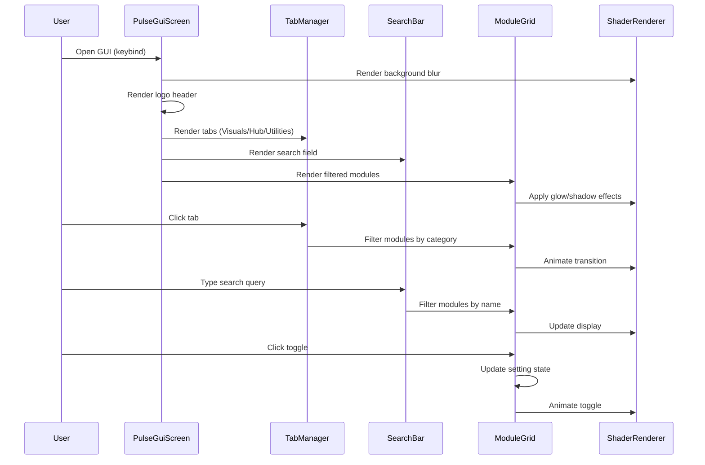
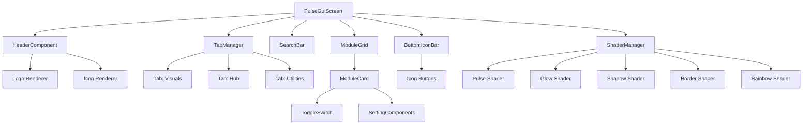

# Design Document: Modern ClickGUI Redesign (Solution Visual Style)

## Overview

This design document outlines the complete redesign of the ClickGUI menu system in the style of Solution Visual. The redesign transforms the existing simple panel-based UI into a modern, visually appealing interface featuring a dark theme with black and white color scheme, tabbed navigation, search functionality, two-column settings layout, and shader-based visual effects. The design leverages existing rendering functions (DrawHelper.drawRoundedRect, drawGlow, drawRect) and the custom Biko.ttf font to create a polished, professional appearance suitable for Minecraft 1.8.9 Forge mods.

**Key Constraint**: Only use existing functions from DrawHelper, ColorHelper, HoverUtil, and Element base class. No new rendering primitives.

## Main Algorithm/Workflow



## Architecture



## Core Interfaces/Types

### PulseGuiScreen

```java
public class PulseGuiScreen extends GuiScreen {
    // Screen dimensions and positioning
    private double x, y, width, height;
    
    // Components
    private HeaderComponent header;
    private TabManager tabManager;
    private SearchBar searchBar;
    private ModuleGrid moduleGrid;
    private BottomIconBar iconBar;
    private ShaderManager shaderManager;
    
    // Animation state
    private LinearAnimation openAnimation;
    private LinearAnimation fadeAnimation;
    
    // Current state
    private Tab currentTab;
    private String searchQuery;
    
    public void init();
    public void render(MatrixStack matrices, int mouseX, int mouseY, float partialTicks);
    public boolean mouseClicked(double mouseX, double mouseY, int mouseButton);
    public boolean keyPressed(int keyCode, int scanCode, int modifiers);
    public void onClose();
}
```

### HeaderComponent

```java
public class HeaderComponent extends Element {
    private String logoText;
    private ResourceLocation logoIcon;
    private double logoX, logoY;
    private double iconSize;
    
    public void render(MatrixStack matrices, double mouseX, double mouseY);
    public void renderLogo(MatrixStack matrices);
    public void renderIcon(MatrixStack matrices);
}
```

### TabManager

```java
public class TabManager extends Element {
    private List<Tab> tabs;
    private Tab activeTab;
    private LinearAnimation slideAnimation;
    private double tabWidth, tabHeight;
    private double tabSpacing;
    
    public void render(MatrixStack matrices, double mouseX, double mouseY);
    public boolean mouseClicked(double mouseX, double mouseY, int mouseButton);
    public void switchTab(Tab newTab);
    public Tab getActiveTab();
}
```

### Tab

```java
public class Tab {
    private String name;
    private TabType type;
    private boolean active;
    private LinearAnimation hoverAnimation;
    
    public enum TabType {
        VISUALS,
        HUB,
        UTILITIES
    }
    
    public void render(MatrixStack matrices, double x, double y, double width, double height);
    public boolean isHovered(double mouseX, double mouseY);
}
```

### SearchBar

```java
public class SearchBar extends Element {
    private String query;
    private String placeholder;
    private boolean focused;
    private int cursorPosition;
    private LinearAnimation focusAnimation;
    private long lastBlinkTime;
    
    public void render(MatrixStack matrices, double mouseX, double mouseY);
    public boolean mouseClicked(double mouseX, double mouseY, int mouseButton);
    public boolean keyPressed(int keyCode, int scanCode, int modifiers);
    public boolean charTyped(char chr, int modifiers);
    public String getQuery();
    public void setQuery(String query);
}
```

### ModuleGrid

```java
public class ModuleGrid extends Element {
    private List<ModuleCard> modules;
    private List<ModuleCard> filteredModules;
    private int columns;
    private double cardWidth, cardHeight;
    private double cardSpacing;
    private double scrollOffset;
    private LinearAnimation scrollAnimation;
    
    public void render(MatrixStack matrices, double mouseX, double mouseY);
    public boolean mouseClicked(double mouseX, double mouseY, int mouseButton);
    public boolean mouseScrolled(double mouseX, double mouseY, double delta);
    public void filterByTab(Tab tab);
    public void filterBySearch(String query);
    public void updateLayout();
}
```

### ModuleCard

```java
public class ModuleCard extends Element {
    private String moduleName;
    private String moduleIcon;
    private boolean enabled;
    private ToggleSwitch toggleSwitch;
    private LinearAnimation hoverAnimation;
    private LinearAnimation enableAnimation;
    
    public void render(MatrixStack matrices, double mouseX, double mouseY);
    public boolean mouseClicked(double mouseX, double mouseY, int mouseButton);
    public void toggle();
    public boolean isEnabled();
}
```

### ToggleSwitch

```java
public class ToggleSwitch extends Element {
    private boolean state;
    private LinearAnimation slideAnimation;
    private LinearAnimation colorAnimation;
    private double knobX;
    private Color activeColor;
    private Color inactiveColor;
    
    public void render(MatrixStack matrices, double x, double y);
    public void toggle();
    public boolean getState();
}
```

### BottomIconBar

```java
public class BottomIconBar extends Element {
    private List<IconButton> icons;
    private int activeIconIndex;
    private double iconSize;
    private double iconSpacing;
    
    public void render(MatrixStack matrices, double mouseX, double mouseY);
    public boolean mouseClicked(double mouseX, double mouseY, int mouseButton);
    public void setActiveIcon(int index);
}
```

### IconButton

```java
public class IconButton extends Element {
    private String iconChar;
    private boolean active;
    private LinearAnimation hoverAnimation;
    private LinearAnimation activeAnimation;
    private Color activeColor;
    
    public void render(MatrixStack matrices, double x, double y);
    public boolean mouseClicked(double mouseX, double mouseY, int mouseButton);
    public void setActive(boolean active);
}
```

### ShaderManager

```java
public class ShaderManager {
    private Map<ShaderType, ShaderProgram> shaders;
    
    public enum ShaderType {
        PULSE,
        BORDER,
        GLOW,
        SHADOW,
        RAINBOW,
        WAVE,
        NOISE,
        CHROMATIC,
        ROUNDED,
        ROUNDED_GRADIENT
    }
    
    public void init();
    public void applyShader(ShaderType type, Runnable renderCallback);
    public void renderWithGlow(double x, double y, double width, double height, int glowRadius, Color color);
    public void renderRoundedRect(double x, double y, double width, double height, double radius, Color color);
    public void renderRoundedGradient(double x, double y, double width, double height, double radius, Color color1, Color color2);
    public void cleanup();
}
```

## Key Functions with Formal Specifications

### Function 1: PulseGuiScreen.init()

```java
public void init()
```

**Preconditions:**
- Minecraft client instance is initialized and running
- Window dimensions are available
- Shader resources exist in assets/hitcolor/shaders/
- Font resources (Biko.ttf, Icons.ttf) are loaded

**Postconditions:**
- GUI dimensions calculated and centered on screen
- All components (header, tabs, search, grid, icons) initialized
- Shaders loaded and ready
- Open animation started
- currentTab set to VISUALS (default)
- searchQuery set to empty string

**Loop Invariants:** N/A

### Function 2: ModuleGrid.filterBySearch()

```java
public void filterBySearch(String query)
```

**Preconditions:**
- modules list is initialized and contains valid ModuleCard objects
- query is non-null (may be empty string)

**Postconditions:**
- filteredModules contains only modules whose name contains query (case-insensitive)
- If query is empty, filteredModules equals modules
- Layout updated to reflect new filtered list
- Scroll offset reset to 0

**Loop Invariants:**
- For each iteration through modules: all previously checked modules have been correctly added to filteredModules if they match

### Function 3: TabManager.switchTab()

```java
public void switchTab(Tab newTab)
```

**Preconditions:**
- newTab is non-null and exists in tabs list
- newTab is different from activeTab

**Postconditions:**
- activeTab updated to newTab
- Slide animation started
- ModuleGrid filtered to show only modules for newTab category
- Previous tab's active state set to false
- New tab's active state set to true

**Loop Invariants:** N/A

### Function 4: ShaderManager.renderWithGlow()

```java
public void renderWithGlow(double x, double y, double width, double height, int glowRadius, Color color)
```

**Preconditions:**
- Shaders initialized successfully
- OpenGL context is valid
- width > 0 and height > 0
- glowRadius >= 0
- color is non-null

**Postconditions:**
- Glow effect rendered around specified rectangle
- Main rectangle rendered with specified color
- OpenGL state restored to previous state
- No side effects on other rendering

**Loop Invariants:** N/A

### Function 5: ToggleSwitch.toggle()

```java
public void toggle()
```

**Preconditions:**
- ToggleSwitch is initialized
- Animations are ready

**Postconditions:**
- state flipped (true → false or false → true)
- slideAnimation started to move knob
- colorAnimation started to change background color
- Associated module's enabled state updated

**Loop Invariants:** N/A

## Algorithmic Pseudocode

### Main Rendering Algorithm

```pascal
ALGORITHM renderPulseGui(matrices, mouseX, mouseY, partialTicks)
INPUT: matrices (MatrixStack), mouseX (double), mouseY (double), partialTicks (float)
OUTPUT: Rendered GUI on screen

BEGIN
  ASSERT openAnimation.isInitialized() = true
  ASSERT shaderManager.isReady() = true
  
  // Step 1: Calculate animation progress
  alpha ← fadeAnimation.getAndUpdate()
  scale ← openAnimation.getAndUpdate()
  
  // Step 2: Apply transformations
  PUSH_MATRIX()
  TRANSLATE(x + width / 2, y + height / 2, 0)
  SCALE(scale, scale, 1)
  TRANSLATE(-(x + width / 2), -(y + height / 2), 0)
  
  // Step 3: Render background with blur
  shaderManager.applyShader(BLUR, () -> {
    renderRect(x, y, width, height, backgroundColor.withAlpha(alpha * 0.85))
  })
  
  // Step 4: Render border with glow
  shaderManager.renderWithGlow(x, y, width, height, 15, borderColor.withAlpha(alpha))
  shaderManager.renderRoundedRect(x, y, width, height, 8, TRANSPARENT)
  
  // Step 5: Render components in order
  header.render(matrices, mouseX, mouseY)
  tabManager.render(matrices, mouseX, mouseY)
  searchBar.render(matrices, mouseX, mouseY)
  
  // Step 6: Apply scissor for module grid
  ENABLE_SCISSOR(x + 10, y + 80, width - 20, height - 140)
  moduleGrid.render(matrices, mouseX, mouseY)
  DISABLE_SCISSOR()
  
  // Step 7: Render bottom icons
  iconBar.render(matrices, mouseX, mouseY)
  
  POP_MATRIX()
  
  ASSERT alpha >= 0 AND alpha <= 1
  ASSERT scale >= 0.8 AND scale <= 1
END
```

**Preconditions:**
- GUI is initialized
- All components are ready
- OpenGL context is valid

**Postconditions:**
- Complete GUI rendered to screen
- All animations updated
- Matrix stack restored
- Scissor test disabled

**Loop Invariants:**
- Matrix stack depth remains consistent
- Alpha values remain in [0, 1] range

### Module Filtering Algorithm

```pascal
ALGORITHM filterModules(tab, searchQuery)
INPUT: tab (Tab), searchQuery (String)
OUTPUT: filteredModules (List<ModuleCard>)

BEGIN
  ASSERT modules IS NOT NULL
  ASSERT tab IS NOT NULL
  ASSERT searchQuery IS NOT NULL
  
  filteredModules ← EMPTY_LIST
  
  // Step 1: Filter by tab category
  FOR each module IN modules DO
    ASSERT module.getCategory() IS VALID
    
    IF module.getCategory() = tab.getType() THEN
      // Step 2: Filter by search query
      IF searchQuery.isEmpty() OR 
         module.getName().toLowerCase().contains(searchQuery.toLowerCase()) THEN
        filteredModules.add(module)
      END IF
    END IF
  END FOR
  
  // Step 3: Update layout
  updateLayout(filteredModules)
  
  ASSERT filteredModules.size() <= modules.size()
  ASSERT ALL module IN filteredModules: module.getCategory() = tab.getType()
  
  RETURN filteredModules
END
```

**Preconditions:**
- modules list is initialized and non-null
- tab is valid Tab object
- searchQuery is non-null string (may be empty)

**Postconditions:**
- filteredModules contains only modules matching both tab and search criteria
- Original modules list unchanged
- Layout updated to reflect filtered list

**Loop Invariants:**
- All modules added to filteredModules match the tab category
- All modules added to filteredModules match the search query (if non-empty)

### Toggle Animation Algorithm

```pascal
ALGORITHM animateToggle(toggleSwitch)
INPUT: toggleSwitch (ToggleSwitch)
OUTPUT: Animated toggle state change

BEGIN
  ASSERT toggleSwitch IS NOT NULL
  ASSERT toggleSwitch.slideAnimation IS INITIALIZED
  
  // Step 1: Flip state
  oldState ← toggleSwitch.state
  toggleSwitch.state ← NOT oldState
  
  // Step 2: Calculate target positions
  IF toggleSwitch.state = true THEN
    targetKnobX ← toggleSwitch.width - toggleSwitch.knobSize - 2
    targetColor ← toggleSwitch.activeColor
  ELSE
    targetKnobX ← 2
    targetColor ← toggleSwitch.inactiveColor
  END IF
  
  // Step 3: Start animations
  toggleSwitch.slideAnimation.begin(
    toggleSwitch.knobX,
    targetKnobX,
    ANIMATION_DURATION
  )
  
  toggleSwitch.colorAnimation.begin(
    toggleSwitch.currentColor,
    targetColor,
    ANIMATION_DURATION
  )
  
  // Step 4: Update module state
  toggleSwitch.module.setEnabled(toggleSwitch.state)
  
  ASSERT toggleSwitch.state = NOT oldState
  ASSERT toggleSwitch.slideAnimation.isAnimating() = true
END
```

**Preconditions:**
- toggleSwitch is initialized
- Animations are ready
- Module reference is valid

**Postconditions:**
- State flipped
- Animations started
- Module enabled state updated
- Visual feedback initiated

**Loop Invariants:** N/A

## Example Usage

```java
// Example 1: Opening the GUI
public class HitColor {
    private PulseGuiScreen guiScreen;
    
    public void init() {
        guiScreen = new PulseGuiScreen();
        
        // Register keybind
        KeyBinding openGuiKey = new KeyBinding("Open GUI", Keyboard.KEY_RSHIFT, "Hit Color");
        ClientRegistry.registerKeyBinding(openGuiKey);
    }
    
    @SubscribeEvent
    public void onKeyInput(InputEvent.KeyInputEvent event) {
        if (openGuiKey.isPressed()) {
            MC.displayGuiScreen(guiScreen);
        }
    }
}

// Example 2: Creating a module card
ModuleCard animationsCard = new ModuleCard("Animations", "A", true);
animationsCard.setCategory(Tab.TabType.VISUALS);
animationsCard.setToggleCallback(() -> {
    AnimationsModule.toggle();
    ConfigManager.save();
});

// Example 3: Applying shader effects
shaderManager.renderWithGlow(x, y, width, height, 15, new Color(20, 20, 30, 200));
shaderManager.renderRoundedRect(x, y, width, height, 8, new Color(40, 40, 50, 220));

// Example 4: Handling search
searchBar.setOnQueryChanged(query -> {
    moduleGrid.filterBySearch(query);
});

// Example 5: Tab switching
tabManager.setOnTabChanged(newTab -> {
    moduleGrid.filterByTab(newTab);
    searchBar.setQuery(""); // Clear search when switching tabs
});

// Example 6: Rendering with animations
@Override
public void render(MatrixStack matrices, int mouseX, int mouseY, float partialTicks) {
    double alpha = fadeAnimation.getAndUpdate();
    double scale = openAnimation.getAndUpdate();
    
    GlStateManager.pushMatrix();
    GlStateManager.translated(centerX, centerY, 0);
    GlStateManager.scaled(scale, scale, 1);
    GlStateManager.translated(-centerX, -centerY, 0);
    
    // Render with alpha
    Color bgColor = ColorHelper.injectAlpha(BACKGROUND_COLOR, (float)alpha);
    shaderManager.renderWithGlow(x, y, width, height, 15, bgColor);
    
    // Render components
    header.render(matrices, mouseX, mouseY);
    tabManager.render(matrices, mouseX, mouseY);
    searchBar.render(matrices, mouseX, mouseY);
    moduleGrid.render(matrices, mouseX, mouseY);
    iconBar.render(matrices, mouseX, mouseY);
    
    GlStateManager.popMatrix();
}
```

## Correctness Properties

### Universal Quantification Statements

1. **GUI Visibility**: ∀ state ∈ GuiStates: (state = OPEN) ⟹ (alpha ∈ [0, 1] ∧ scale ∈ [0.8, 1])

2. **Module Filtering**: ∀ module ∈ filteredModules: (module.category = currentTab.type) ∧ (searchQuery.isEmpty() ∨ module.name.contains(searchQuery))

3. **Toggle Consistency**: ∀ toggle ∈ ToggleSwitches: (toggle.state = true) ⟺ (toggle.module.enabled = true)

4. **Animation Bounds**: ∀ animation ∈ Animations: (animation.value >= animation.start) ∧ (animation.value <= animation.end)

5. **Component Positioning**: ∀ component ∈ Components: (component.x >= gui.x) ∧ (component.x + component.width <= gui.x + gui.width)

6. **Tab Uniqueness**: ∀ tab1, tab2 ∈ Tabs: (tab1 ≠ tab2) ⟹ (tab1.active ∧ tab2.active = false)

7. **Search Responsiveness**: ∀ query ∈ SearchQueries: (query.length > 0) ⟹ (filteredModules.size() <= modules.size())

8. **Shader State**: ∀ shader ∈ Shaders: (shader.applied = true) ⟹ (OpenGL.state.restored = true after render)

9. **Icon Bar State**: ∀ icon ∈ IconBar.icons: (icon.index = activeIconIndex) ⟺ (icon.active = true)

10. **Scroll Bounds**: ∀ scroll ∈ ScrollOffsets: (scroll >= 0) ∧ (scroll <= maxScrollOffset)

## Data Models

### GuiDimensions

```java
public class GuiDimensions {
    double x;              // GUI x position (centered)
    double y;              // GUI y position (centered)
    double width;          // GUI width (420 pixels)
    double height;         // GUI height (320 pixels)
    double scale;          // Current scale factor (0.8 to 1.0)
    double alpha;          // Current alpha value (0.0 to 1.0)
}
```

**Validation Rules:**
- width must be 420
- height must be 320
- scale must be between 0.8 and 1.0
- alpha must be between 0.0 and 1.0
- x and y must center the GUI on screen

### ModuleData

```java
public class ModuleData {
    String name;           // Module display name
    String iconChar;       // Icon character from Icons.ttf
    TabType category;      // VISUALS, HUB, or UTILITIES
    boolean enabled;       // Current enabled state
    List<Setting> settings; // Module settings (if any)
}
```

**Validation Rules:**
- name must be non-empty and unique
- iconChar must be valid character from icon font
- category must be one of three valid types
- settings list must be non-null (may be empty)

### ColorScheme

```java
public class ColorScheme {
    Color backgroundColor;      // Main background (6, 6, 6, 255) - BACKGROUND_PRIMARY
    Color secondaryBackground;  // Secondary background (33, 33, 33, 255) - BACKGROUND_SECONDARY
    Color borderColor;          // Border color (60, 60, 60, 255)
    Color accentColor;          // White accent (255, 255, 255, 255) - MAIN
    Color textPrimary;          // White text (255, 255, 255, 255)
    Color textSecondary;        // Gray text (180, 180, 180, 255)
    Color toggleActive;         // Active toggle (255, 255, 255, 255)
    Color toggleInactive;       // Inactive toggle (60, 60, 60, 255)
    Color hoverOverlay;         // Hover effect (255, 255, 255, 20)
}
```

**Validation Rules:**
- All colors must have valid RGBA values (0-255)
- Alpha values should support transparency
- Accent color is white for black/white theme
- Use existing GuiScreen.MAIN, BACKGROUND_PRIMARY, BACKGROUND_SECONDARY constants

### AnimationState

```java
public class AnimationState {
    double startValue;     // Animation start value
    double endValue;       // Animation end value
    double currentValue;   // Current interpolated value
    long startTime;        // Animation start timestamp
    long duration;         // Animation duration in milliseconds
    boolean active;        // Whether animation is running
}
```

**Validation Rules:**
- duration must be positive
- currentValue must be between startValue and endValue during animation
- startTime must be valid timestamp
- active must be false when animation completes

## Error Handling

### Error Scenario 1: Shader Loading Failure

**Condition**: Shader files missing or corrupted in assets/hitcolor/shaders/
**Response**: Log error, fall back to basic OpenGL rendering without shaders
**Recovery**: GUI remains functional with reduced visual effects

### Error Scenario 2: Font Loading Failure

**Condition**: Biko.ttf or Icons.ttf not found or corrupted
**Response**: Fall back to Minecraft's default font renderer
**Recovery**: GUI displays with default font, functionality preserved

### Error Scenario 3: Invalid Module Data

**Condition**: Module configuration contains invalid category or null values
**Response**: Skip invalid module, log warning, continue loading other modules
**Recovery**: GUI displays all valid modules, invalid ones ignored

### Error Scenario 4: Animation Overflow

**Condition**: Animation value exceeds expected bounds due to timing issues
**Response**: Clamp value to valid range [start, end]
**Recovery**: Animation completes normally with clamped value

### Error Scenario 5: Search Query Too Long

**Condition**: User attempts to type more than 64 characters in search
**Response**: Ignore additional characters, maintain 64-character limit
**Recovery**: Search continues to function with truncated query

## Testing Strategy

### Unit Testing Approach

**Key Test Cases:**
1. **Component Initialization**: Verify all components initialize with correct default values
2. **Animation Calculations**: Test interpolation functions with various inputs
3. **Filtering Logic**: Verify module filtering with different tab/search combinations
4. **Color Manipulation**: Test alpha injection and color blending
5. **Bounds Checking**: Verify all positioning stays within GUI bounds
6. **State Management**: Test toggle state synchronization with module state

**Coverage Goals:**
- 90% code coverage for core logic
- 100% coverage for filtering and search algorithms
- All error handling paths tested

### Property-Based Testing Approach

**Property Test Library**: fast-check (JavaScript) or QuickCheck-style for Java

**Properties to Test:**
1. **Filtering Idempotence**: Applying same filter twice produces same result
2. **Animation Monotonicity**: Animation values always progress toward target
3. **Color Alpha Bounds**: Alpha values always remain in [0, 1] range
4. **Search Commutativity**: Filter by tab then search = search then filter by tab
5. **Toggle Consistency**: Module enabled state always matches toggle state

### Integration Testing Approach

**Integration Test Scenarios:**
1. **Full GUI Lifecycle**: Open → interact → close → reopen
2. **Tab Switching**: Switch between all tabs, verify correct modules shown
3. **Search + Tab Interaction**: Search while switching tabs
4. **Shader Pipeline**: Verify all shaders render correctly in sequence
5. **Config Persistence**: Save settings, restart, verify settings restored

## Performance Considerations

**Rendering Optimization:**
- Use scissor test to avoid rendering off-screen modules
- Batch shader calls to minimize state changes
- Cache filtered module lists until filter criteria change
- Limit animation updates to 60 FPS

**Memory Management:**
- Reuse MatrixStack instances
- Pool frequently allocated objects (Color, animations)
- Lazy-load module settings until expanded
- Clean up shader resources on GUI close

**Scroll Performance:**
- Implement virtual scrolling for large module lists
- Only render visible modules plus small buffer
- Smooth scroll animation with easing

## Security Considerations

**Input Validation:**
- Sanitize search query input to prevent injection
- Validate module names and settings from config files
- Limit string lengths to prevent memory issues

**Resource Access:**
- Verify shader file paths to prevent directory traversal
- Validate font file integrity before loading
- Restrict config file access to designated directory

## Dependencies

**External Libraries:**
- Minecraft Forge 1.8.9
- LWJGL 2.9.x (OpenGL bindings)
- Gson (JSON config parsing)

**Internal Dependencies:**
- Custom shader system (existing)
- Font rendering system (Biko.ttf, Icons.ttf)
- Animation framework (LinearAnimation, EaseAnimation)
- Color helper utilities
- Draw helper utilities

**Resource Files:**
- assets/hitcolor/shaders/*.frag (fragment shaders)
- assets/hitcolor/shaders/vertex.vert (vertex shader)
- assets/hitcolor/font/Biko.ttf (custom font)
- assets/hitcolor/font/Icons.ttf (icon font)
- Logo image/icon for Solution Visual branding
